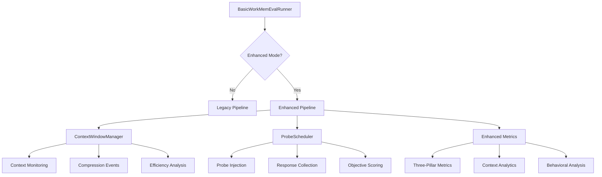

# Enhanced Evaluation System

## Overview

The Enhanced Evaluation System extends WorkMemEval's basic evaluation capabilities with sophisticated memory research tools while maintaining complete backward compatibility. This system implements the three-pillar memory evaluation framework through context window management, memory probe injection, and enhanced metrics collection.

## Architecture Components

### Core Components



### Component Integration

The enhanced system integrates seamlessly with existing WorkMemEval components:

- **Task Specification**: Enhanced tasks auto-detected and configured
- **Action Tracing**: Extended with new action types for enhanced events
- **Memory Systems**: Context management works with existing memory implementations
- **Agent Implementations**: Probes integrate naturally with agent execution flow

## Three-Pillar Memory Evaluation Framework

### Memory Fidelity Pillar

**Focus**: Information retention and compression effectiveness

**Evaluation Methods**:
- **N-Back Integration Probes**: Test recall of specifications from previous checkpoints
- **Compression Stress Tests**: Evaluate information retention after context compression
- **Context Efficiency Monitoring**: Measure information density and relevance precision

**Metrics Collected**:
```python
{
    "memory_fidelity_score": 0.85,
    "n_back_accuracy": 0.78,
    "compression_effectiveness": 0.92,
    "information_retention_rate": 0.88
}
```

### Contextual Relevance Pillar

**Focus**: Signal vs. noise filtering and attention management

**Evaluation Methods**:
- **Distractor Injection**: Test filtering of relevant vs. irrelevant information
- **Change Detection Probes**: Evaluate detection of critical specification changes
- **Context Re-reading Analysis**: Detect inefficient information access patterns

**Metrics Collected**:
```python
{
    "contextual_relevance_score": 0.76,
    "distractor_filtering_accuracy": 0.82,
    "change_detection_rate": 0.71,
    "relevance_precision": 0.79
}
```

### Behavioral Integrity Pillar

**Focus**: State coherence and robustness under stress

**Evaluation Methods**:
- **Update Robustness Tests**: Evaluate propagation of requirement changes
- **Context Switch Challenges**: Test resumption after task interruption
- **Integration Consistency**: Monitor coherence across checkpoint dependencies

**Metrics Collected**:
```python
{
    "behavioral_integrity_score": 0.91,
    "update_propagation_accuracy": 0.88,
    "context_switch_recovery_rate": 0.94,
    "integration_consistency": 0.89
}
```

## Context Window Management

### Evaluation Conditions

#### Standardized Condition
```python
# Fixed 8K context window for fair comparison
runner = BasicWorkMemEvalRunner(
    enable_enhanced_evaluation=True,
    context_condition="standardized"
)
```

**Purpose**: Enable fair comparison across different agents and memory systems
**Token Limit**: 8,192 tokens (industry standard)
**Use Cases**: Benchmarking, comparative studies, baseline evaluation

#### Native Condition
```python
# Agent's natural context capacity
runner = BasicWorkMemEvalRunner(
    enable_enhanced_evaluation=True,
    context_condition="native"
)
```

**Purpose**: Evaluate agents under their optimal operating conditions
**Token Limit**: Auto-detected from agent configuration
**Use Cases**: Performance optimization, capability assessment, real-world simulation

#### Overflow Condition
```python
# Forced context overflow to stress memory systems
runner = BasicWorkMemEvalRunner(
    enable_enhanced_evaluation=True,
    context_condition="overflow"
)
```

**Purpose**: Stress-test memory systems and compression capabilities
**Token Limit**: 2x native capacity (configurable multiplier)
**Use Cases**: Memory system robustness testing, compression algorithm evaluation

### Context Monitoring Features

#### Real-time Usage Tracking
```python
class ContextUsageMetrics:
    current_tokens: int
    token_limit: int
    utilization_percentage: float
    relevant_tokens: int
    irrelevant_tokens: int
    redundant_tokens: int
    efficiency_score: float
    state: ContextState  # NORMAL, APPROACHING_LIMIT, OVERFLOW, COMPRESSED
```

#### Compression Event Management
```python
# Automatic compression triggering
if context_metrics.state == ContextState.OVERFLOW:
    compression_result = context_manager.trigger_compression_event(
        agent, memory_system, action_tracer
    )
```

#### Efficiency Analysis
```python
class ContextEfficiencyMetrics:
    relevance_precision: float      # % of context that's task-relevant
    information_density: float      # Task-relevant information per token
    redundancy_rate: float         # Repeated information access patterns
    compression_effectiveness: float # Information retention after compression
```

## Memory Probe System

### Probe Types and Scheduling

#### Intelligent Probe Scheduling
```python
class ProbeScheduler:
    def schedule_probes(self, probes: List[MemoryProbe], 
                       task_spec: TaskSpecification) -> Dict[str, List[MemoryProbe]]:
        # 1. Calculate memory pressure scores
        # 2. Determine pillar-specific stress levels
        # 3. Identify optimal injection timing
        # 4. Validate probe independence
        # 5. Schedule with natural integration
```

#### Probe Interference Detection
```python
def _calculate_probe_interference(self, probe1: MemoryProbe, probe2: MemoryProbe) -> float:
    """Calculate interference score (0.0 = no interference, 1.0 = high interference)"""
    interference = 0.0
    
    # Same checkpoint increases interference
    if probe1.target_checkpoint == probe2.target_checkpoint:
        interference += 0.5
    
    # Same pillar increases interference
    if probe1.pillar == probe2.pillar:
        interference += 0.3
    
    # Same probe type creates high interference
    if probe1.probe_type == probe2.probe_type:
        interference += 0.4
    
    return min(interference, 1.0)
```

### Probe Implementation Examples

#### N-Back Integration Probe
```python
probe = MemoryProbe(
    probe_id="n_back_integration_cp3",
    probe_type=ProbeType.N_BACK_INTEGRATION,
    pillar=MemoryPillar.MEMORY_FIDELITY,
    target_checkpoint="checkpoint_3",
    description="Integrate current component with specifications from 2 checkpoints ago",
    n_back_distance=2
)

# Challenge presented to agent:
"Integrate current component with specifications from 2 checkpoints ago. 
Use exact specifications without re-reading files."
```

#### Distractor Injection Probe
```python
probe = MemoryProbe(
    probe_id="distractor_filter_cp2",
    probe_type=ProbeType.DISTRACTOR_INJECTION,
    pillar=MemoryPillar.CONTEXTUAL_RELEVANCE,
    target_checkpoint="checkpoint_2",
    description="Filter relevant requirements from multiple similar specifications",
    distractor_ratio=0.3
)

# Challenge presented to agent:
"Multiple similar requirements provided. Identify and implement only 
the relevant specifications for checkpoint_2."
```

#### Context Switch Probe
```python
probe = MemoryProbe(
    probe_id="context_switch_cp4",
    probe_type=ProbeType.CONTEXT_SWITCH,
    pillar=MemoryPillar.BEHAVIORAL_INTEGRITY,
    target_checkpoint="checkpoint_4",
    description="Resume implementation after task interruption",
    interruption_duration=5
)

# Challenge presented to agent:
"Task interrupted. Debug this unrelated issue, then resume your 
original implementation."
```

## Enhanced Metrics Collection

### Checkpoint-Level Metrics

Enhanced checkpoint results include additional metrics:

```python
class CheckpointResult:
    # Standard metrics (unchanged)
    checkpoint_id: str
    completed_successfully: bool
    execution_time_seconds: float
    tests_passed: bool
    
    # Enhanced metrics (new)
    metadata: Dict[str, Any] = {
        "context_efficiency": 0.85,
        "information_density": 0.78,
        "redundancy_rate": 0.12,
        "probe_responses": [
            {
                "probe_id": "n_back_integration_cp3",
                "success": True,
                "score": 0.87,
                "pillar": "memory_fidelity"
            }
        ],
        "context_rereading_events": 2,
        "redundancy_penalty": 0.15
    }
```

### Task-Level Metrics

Enhanced evaluation results provide comprehensive analysis:

```python
class EvaluationResult:
    # Standard fields (unchanged)
    task_id: str
    agent_name: str
    memory_system_name: str
    task_completed_successfully: bool
    
    # Enhanced analysis (new)
    enhanced_metrics: Dict[str, Any] = {
        "three_pillar_scores": {
            "memory_fidelity": 0.85,
            "contextual_relevance": 0.76,
            "behavioral_integrity": 0.91
        },
        "context_window_analysis": {
            "condition": "standardized",
            "average_utilization": 78.5,
            "compression_events": 3,
            "efficiency_trend": "improving"
        },
        "probe_summary": {
            "total_probes": 6,
            "successful_probes": 5,
            "overall_success_rate": 0.83,
            "pillar_breakdown": {
                "memory_fidelity": {"success_rate": 0.85, "avg_score": 0.82},
                "contextual_relevance": {"success_rate": 0.75, "avg_score": 0.71},
                "behavioral_integrity": {"success_rate": 0.90, "avg_score": 0.89}
            }
        }
    }
```

## Usage Patterns

### Basic Enhanced Evaluation

```python
# Minimal configuration for enhanced evaluation
runner = BasicWorkMemEvalRunner(enable_enhanced_evaluation=True)

result = await runner.run_evaluation(
    task_path="tasks/memory_intensive_task.json",
    agent=research_agent,
    memory_system=contextual_memory_system,
    context_condition="standardized"
)

# Access enhanced metrics
pillar_scores = result.enhanced_metrics["three_pillar_scores"]
context_analysis = result.enhanced_metrics["context_window_analysis"]
probe_results = result.enhanced_metrics["probe_summary"]
```

### Comparative Memory System Evaluation

```python
# Compare multiple memory systems under controlled conditions
memory_systems = [
    ("Contextual", contextual_memory),
    ("Episodic", episodic_memory),
    ("Hybrid", hybrid_memory)
]

results = {}
for name, memory_system in memory_systems:
    result = await runner.run_evaluation(
        task_path="tasks/comparison_benchmark.json",
        agent=standard_agent,
        memory_system=memory_system,
        context_condition="standardized"
    )
    results[name] = result.enhanced_metrics["three_pillar_scores"]

# Analyze comparative performance
for system_name, scores in results.items():
    print(f"{system_name}: Fidelity={scores['memory_fidelity']:.2f}, "
          f"Relevance={scores['contextual_relevance']:.2f}, "
          f"Integrity={scores['behavioral_integrity']:.2f}")
```

### Context Window Stress Testing

```python
# Test memory system robustness under overflow conditions
overflow_runner = BasicWorkMemEvalRunner(
    enable_enhanced_evaluation=True,
    context_condition="overflow"
)

result = await overflow_runner.run_evaluation(
    task_path="tasks/complex_integration_task.json",
    agent=test_agent,
    memory_system=memory_system_under_test
)

# Analyze compression effectiveness
context_analysis = result.enhanced_metrics["context_window_analysis"]
compression_events = context_analysis["compression_events"]
efficiency_trend = context_analysis["efficiency_trend"]
```

## Integration with Existing Systems

### Task Specification Enhancement

Tasks automatically detect and enable enhanced features:

```python
# Task with memory probes automatically uses enhanced evaluation
task_spec = TaskSpecification(
    task_id="enhanced_task",
    # ... standard fields ...
    memory_probes=[
        MemoryProbe(
            probe_id="fidelity_test",
            probe_type=ProbeType.N_BACK_INTEGRATION,
            pillar=MemoryPillar.MEMORY_FIDELITY,
            target_checkpoint="checkpoint_2",
            description="Test memory fidelity"
        )
    ]
)

# Enhanced mode automatically detected
assert task_spec.is_enhanced_mode() == True
```

### Memory System Integration

Enhanced evaluation works with existing memory systems:

```python
class ExistingMemorySystem(MemorySystem):
    def compress_context(self):
        # Optional: Implement compression for enhanced evaluation
        return {"success": True, "compression_ratio": 0.6}
    
    # All existing methods work unchanged
    def store_memory(self, content): ...
    def retrieve_memory(self, query): ...
```

### Agent Implementation Support

Agents can optionally support enhanced features:

```python
class EnhancedAgent(AgentImplementation):
    async def handle_memory_probe(self, probe: MemoryProbe, challenge: str) -> str:
        # Optional: Explicit probe handling for better integration
        return await self.process_challenge(challenge)
    
    def get_context_size(self) -> int:
        # Optional: Provide actual context usage for accurate monitoring
        return self.current_context_tokens
    
    # All existing methods work unchanged
    async def execute_checkpoint(self, checkpoint): ...
```

## Performance Considerations

### Overhead Analysis

**Tier 1 (Basic)**: Zero overhead - identical performance to original system
**Tier 2 (Enhanced)**: Minimal overhead (~5-10% execution time increase)
- Context monitoring: ~2% overhead
- Probe injection: ~3-5% overhead (depends on probe count)
- Enhanced metrics: ~1-2% overhead

### Memory Usage

**Additional Memory Requirements**:
- Context history tracking: ~1-2MB per evaluation
- Probe response storage: ~100KB per probe
- Enhanced metrics: ~500KB per evaluation
- Total additional memory: ~2-3MB per evaluation (negligible for most systems)

### Optimization Strategies

**Lazy Initialization**: Enhanced components only created when needed
**Efficient Monitoring**: Context tracking uses sampling for large contexts
**Probe Batching**: Multiple probes can be combined when appropriate
**Metric Caching**: Expensive calculations cached and reused

## Future Enhancements

### Planned Tier 3 Capabilities

**Custom Probe Development**:
```python
class CustomMemoryProbe(MemoryProbe):
    async def generate_challenge(self, context: EvaluationContext) -> str:
        # Custom challenge generation logic
        pass
    
    def score_response(self, response: str, context: EvaluationContext) -> float:
        # Custom scoring algorithm
        pass
```

**Advanced Analytics**:
```python
class MemoryAnalytics:
    def generate_comparative_report(self, results: List[EvaluationResult]) -> Report:
        # Statistical analysis across multiple evaluations
        pass
    
    def identify_memory_patterns(self, trace: TaskTrace) -> List[Pattern]:
        # Pattern recognition in memory usage
        pass
```

**Research Templates**:
```python
# Pre-configured evaluation protocols for common research scenarios
template = ResearchTemplate.memory_system_comparison(
    systems=[system1, system2, system3],
    conditions=["standardized", "native", "overflow"],
    tasks=["simple", "moderate", "complex"]
)
results = await template.execute()
```

This enhanced evaluation system provides a comprehensive framework for memory research while maintaining the simplicity and reliability that makes WorkMemEval accessible to researchers at all levels.